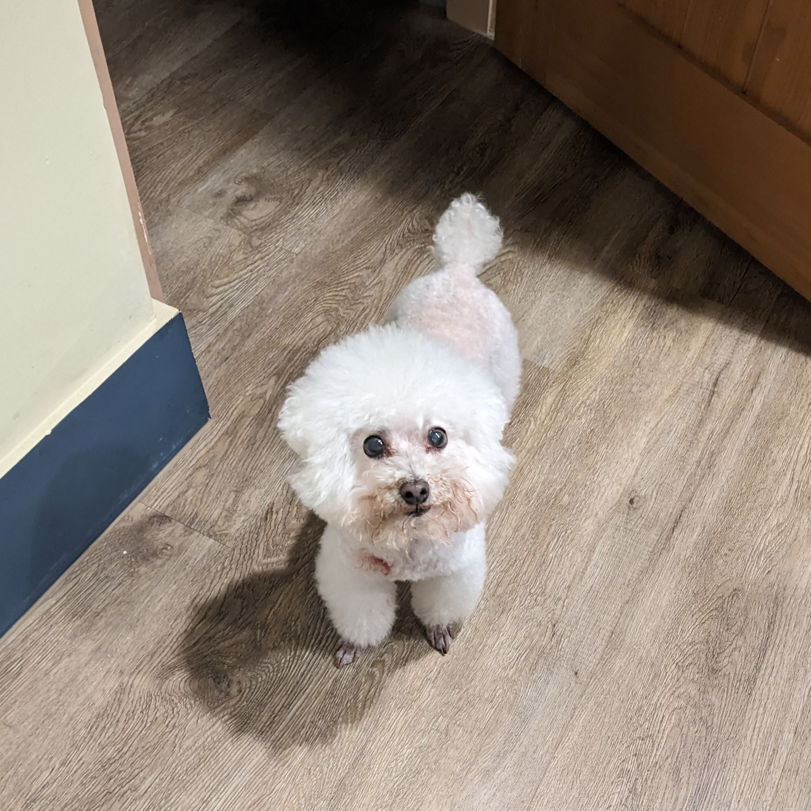

# MiJou Here!

<<<<<<< HEAD

---

### About Me
* 📍 Hometown: Taipei, Taiwan
* 🎓 Education: Master's at HWR Berlin, Bachelor's at National ChengChi University
* 💕 **What I like**
    * Volleyball
    * Comedy shows
    * Interested in AI (LLMs, AI agents, automation, etc.)
    * My dog   
    

---

### Professional & Academic Journey

| Period        | Location              | Role / Achievement                        |
| :------------ | :-------------------- | :---------------------------------------- |
| **2024-25** | ATP Electronics       | **Strategic Business Planing/ AI Project Coordinator** |
| **2023 Winter** | University of Cologne | **🌍Exchange Semester** |
| **2020-24** | Taipei, Taiwan        | **Bachelor in International Business** |

---

### My Journey Map 🗺️

<iframe src="journey_map.html" width="100%" height="600" style="border:1px solid #ddd; border-radius: 8px; box-shadow: 0 2px 4px rgba(0,0,0,0.1);"></iframe>
=======
**Master:** HWR Berlin, BIPM Program
 
**Bachelor:** National ChengChi University, International Business

### Home Town
Taipei, Taiwan

### What I like
* Volleyball
* Dogs
* Comedy Shows

### Academic & Work History
| Period      | Location              | Role                               |
|:------------|:----------------------|:-----------------------------------|
| 2020–2024   | Taipei, Taiwan        | Bachelor in International Business |
| 2023 Winter | University of Cologne | Exchange Semester                  |
| 2024–2025   | ATP Electronics       | AI Project Coordinator             |

### My Journey Map
<iframe src="journey_map.html" width="800" height="600" style="border:none;"></iframe>
>>>>>>> 4f0740d10e590d38abbf3416f7c19e2b499fed93
